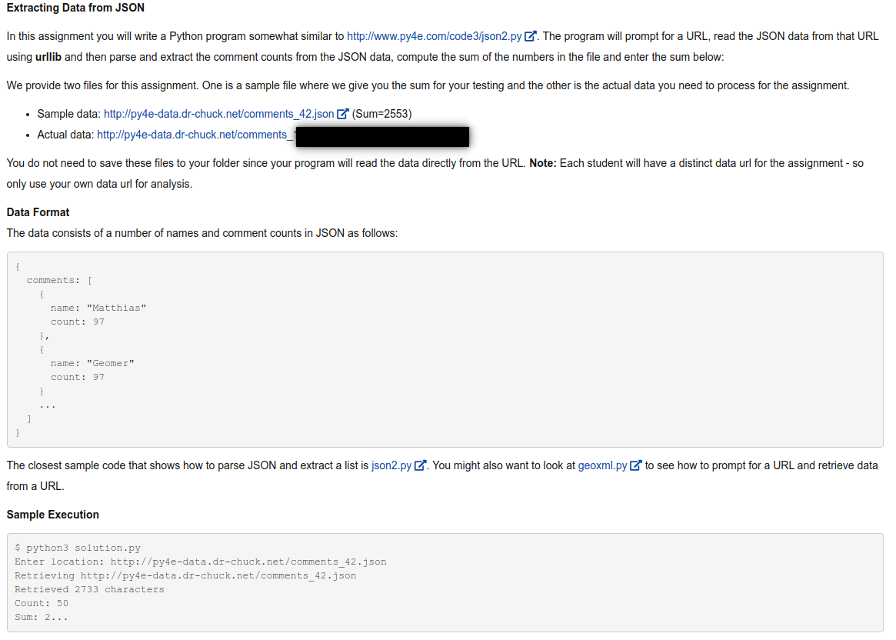

# Python-exercises
### Solution of assignments of "Python for Everybody Specialization" Course by Charles Russell Severance

Assignment 15.4: 
This application will read the mailbox data (mbox.txt) and count the number of email messages per organization (i.e. domain name of the email address) using a database with the following schema to maintain the counts.

  ###### CREATE TABLE Counts (org TEXT, count INTEGER)   

------------------------------------------------------
Assignment 13.9: 
The program will prompt for a location, contact a web service and retrieve JSON for the web service and parse that data, and retrieve the first place_id from the JSON. A place ID is a textual identifier that uniquely identifies a place as within Google Maps.   

------------------------------------------------------
Assignment 13.8: 
The program will prompt for a URL, read the JSON data from that URL using urllib and then parse and extract the comment counts from the JSON data, compute the sum of the numbers in the file.   

------------------------------------------------------
Assignment 13.5:  

Python program: prompt for a URL, read the XML data from that URL using urllib and then parse and extract the comment counts from the XML data, compute the sum of the numbers in the file.    

